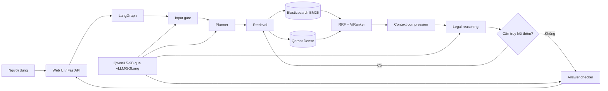

# Vietnamese Legal Assistant — Group Project

Hệ thống hỏi đáp pháp luật tiếng Việt sử dụng Retrieval-Augmented Generation (RAG). Ứng dụng truy hồi văn bản pháp luật từ Elasticsearch và Qdrant, rerank bằng ViRanker, sau đó dùng LangGraph để lập kế hoạch, kiểm tra bằng chứng, sinh câu trả lời và trả citation cho người dùng.

Project nhóm tái sử dụng trực tiếp pipeline production tại [`../src/main`](../src/main/README.md). Phần evaluation tại [`evaluation`](evaluation/) cung cấp golden dataset 20 câu, so sánh A/B hai cấu hình truy hồi và chấm bằng LLM-as-a-Judge hoặc RAGAS.

> **Lưu ý:** câu trả lời của hệ thống chỉ có mục đích tham khảo, không thay thế tư vấn pháp lý từ người có chuyên môn.

## Chức năng chính

- Hỏi đáp pháp luật tiếng Việt qua Web UI hoặc REST API.
- Hybrid search: Elasticsearch BM25 kết hợp Qdrant dense retrieval bằng RRF.
- ViRanker reranking để ưu tiên các điều khoản liên quan nhất.
- LangGraph điều phối input gate, planner, retrieval, nén context, reasoning và answer checker.
- Trả nguồn tài liệu/citation đã dùng để người dùng kiểm tra lại.
- Hỗ trợ câu hỏi tiếp nối bằng conversation state; không lặp lại câu trả lời cũ khi lượt mới không bổ sung thông tin cần xử lý.
- Evaluation có checkpoint, tự bỏ qua case đã hoàn thành và chạy song song tối đa 10 case theo mặc định.

## Kiến trúc



Luồng xử lý chính trong `src/main/Agents/graph.py`:

1. `input_gate_node` phân loại và kiểm tra đầu vào.
2. `planner_node` tạo các truy vấn pháp lý cần tìm.
3. `batch_hybrid_search_node` truy hồi theo cấu hình đang dùng.
4. `compress_node` lọc và rút gọn evidence.
5. `reasoning_node` lập luận, sinh câu trả lời hoặc yêu cầu gọi search tool thêm.
6. `answer_checker_node` kiểm tra câu trả lời trước khi trả về.

## Công nghệ

| Thành phần | Công nghệ |
|---|---|
| Orchestration | LangGraph |
| Sparse retrieval | Elasticsearch BM25 |
| Dense retrieval | Qdrant + VietLegal Harrier embeddings |
| Reranking | ViRanker |
| LLM serving | Qwen3.5-9B qua vLLM hoặc SGLang |
| Backend / UI | FastAPI + Web UI tĩnh |
| Evaluation | LLM-as-a-Judge, tùy chọn RAGAS 0.4.x |

## Cấu trúc thư mục

```text
K4-Day08-RAG-Pipeline-B1-1/
├── group_project/
│   ├── README.md
│   └── evaluation/
│       ├── golden_dataset.json       # 20 câu hỏi, gold answer và gold context
│       ├── eval_pipeline.py          # A/B evaluation pipeline
│       ├── rag_outputs.json          # raw answer/context và checkpoint
│       ├── evaluation_details.json   # điểm chi tiết từng case
│       └── results.md                # báo cáo tổng hợp
└── src/main/
    ├── Agents/                       # LangGraph, retrieval và legal reasoning
    ├── Web/                          # FastAPI, UI và runtime
    ├── deploy/                       # script quản lý backend/LLM stack
    ├── build_hybrid_index.py
    └── requirements.txt
```

## Yêu cầu môi trường

- Linux, Python 3.12.
- NVIDIA GPU có đủ VRAM và CUDA tương thích.
- Java 8+ cho Elasticsearch.
- Conda environment production: `/home/uet/miniconda3/envs/gemma`.
- Dữ liệu/index/model được cấu hình theo [`../src/main/README.md`](../src/main/README.md). Trong môi trường hiện tại, `src/main/data`, `src/main/dbs` và `src/main/model_cache` liên kết tới tài nguyên trong `/home/uet/cuongdam/Legal_assistant`.

Nếu cần chấm bằng RAGAS thay vì fallback LLM judge:

```bash
/home/uet/miniconda3/envs/gemma/bin/python -m pip install "ragas>=0.4,<0.5"
```

Không cài RAGAS 0.1.x vào environment production vì phiên bản này có thể kéo LangChain về nhánh không tương thích.

## Khởi động hệ thống

Từ thư mục production:

```bash
cd /home/uet/cuongdam/K4-Day08-RAG-Pipeline-B1-1/src/main
bash deploy/start_backend_stack.sh --vllm
```

Nếu dùng file environment riêng:

```bash
LEGAL_ASSISTANT_ENV_FILE=/home/uet/cuongdam/Legal_assistant/legal_assistant.env \
  bash deploy/start_backend_stack.sh --vllm
```

Ví dụ tách LLM và backend sang hai GPU khác nhau:

```bash
LLM_GPU_ID=1 \
BACKEND_GPU_ID=0 \
LLM_PORT=8006 \
BACKEND_PORT=8010 \
CHECKPOINTER_BACKEND=none \
LANGSMITH_TRACING=false \
  bash deploy/start_backend_stack.sh --vllm
```

Chỉ định GPU sau khi kiểm tra VRAM trống bằng `nvidia-smi`; các ID trên là ví dụ, không phải cấu hình bắt buộc.

Sau khi stack sẵn sàng:

| Dịch vụ | Địa chỉ mặc định |
|---|---|
| Web UI | <http://localhost:8010/> |
| Health check | <http://localhost:8010/health> |
| Readiness check | <http://localhost:8010/ready> |
| LLM models | <http://localhost:8006/v1/models> |
| Elasticsearch | <http://localhost:9201> |
| Qdrant collections | <http://localhost:6333/collections> |

## Evaluation

### Golden dataset và hai cấu hình A/B

[`evaluation/golden_dataset.json`](evaluation/golden_dataset.json) gồm 20 câu hỏi pháp luật được lấy từ bộ dữ liệu đầu vào, mỗi mẫu có gold answer và tài liệu pháp luật cần truy hồi.

| Cấu hình | Retrieval | Reranking |
|---|---|---|
| A — `hybrid_rerank` | Elasticsearch BM25 + Qdrant dense, hợp nhất bằng RRF | ViRanker |
| B — `dense_only` | Chỉ Qdrant dense | Không |

Hai cấu hình dùng chung các bước planner, lọc evidence, reasoning và answer checker để phép so sánh tập trung vào retrieval/reranking.

Các metric:

- `faithfulness`: câu trả lời có bám vào context không.
- `answer_relevance`: câu trả lời có trực tiếp giải quyết câu hỏi không.
- `context_recall`: retriever có lấy đủ gold evidence không.
- `context_precision`: context truy hồi có tập trung vào evidence hữu ích không.
- `llm_judge_correctness`: mức đúng so với gold answer, kèm verdict, failure stage và lý do.

### Chạy evaluation

Đảm bảo backend, LLM, Elasticsearch và Qdrant đang hoạt động, sau đó chạy:

```bash
cd /home/uet/cuongdam/K4-Day08-RAG-Pipeline-B1-1

LLM_BASE_URL=http://localhost:8006/v1 \
LLM_API_KEY=EMPTY \
  /home/uet/miniconda3/envs/gemma/bin/python \
  group_project/evaluation/eval_pipeline.py --workers 10
```

`--workers 10` là số case LangGraph chạy đồng thời, không phải số reranker worker. Reranker production được điều khiển riêng bằng `RERANKER_MAX_CONCURRENT` (mặc định `1`) và `RERANKER_BATCH_SIZE` (mặc định `64`). Chỉ tăng concurrency khi GPU còn đủ VRAM.

Một số chế độ hữu ích:

```bash
# Smoke test một câu và dùng LLM judge
/home/uet/miniconda3/envs/gemma/bin/python \
  group_project/evaluation/eval_pipeline.py \
  --limit 1 --evaluator llm-judge

# Chỉ chấm lại các raw output đã có
/home/uet/miniconda3/envs/gemma/bin/python \
  group_project/evaluation/eval_pipeline.py --score-only --workers 10

# Bỏ checkpoint và chạy lại toàn bộ
/home/uet/miniconda3/envs/gemma/bin/python \
  group_project/evaluation/eval_pipeline.py --no-resume --workers 10
```

Pipeline ghi `rag_outputs.json` sau từng case. Khi chạy lại, các case đã thành công sẽ được bỏ qua; điểm hợp lệ trong `evaluation_details.json` cũng được tái sử dụng nếu answer, context và gold data không thay đổi.

Script cần dependency production trong environment `gemma`. Nếu được gọi từ environment thiếu `langgraph`, script sẽ thử chuyển sang `/home/uet/miniconda3/envs/gemma/bin/python`. Có thể đổi interpreter bằng `LEGAL_RAG_PYTHON`.

### File kết quả

| File | Nội dung |
|---|---|
| [`evaluation/rag_outputs.json`](evaluation/rag_outputs.json) | Answer, retrieved context, latency, trạng thái và lỗi của từng config |
| [`evaluation/evaluation_details.json`](evaluation/evaluation_details.json) | Điểm từng metric và nhận xét của judge cho từng case |
| [`evaluation/results.md`](evaluation/results.md) | Bảng tổng hợp, worst performers và khuyến nghị |

### Kết quả lần chạy hiện tại

Lần chạy hoàn tất 40/40 case, tương ứng 20 câu × 2 cấu hình. Báo cáo hiện tại dùng **LLM-as-a-Judge** cho các metric.

| Metric | A: Hybrid + rerank | B: Dense only | Chênh lệch A − B |
|---|---:|---:|---:|
| Faithfulness | 0.695 | 0.620 | +0.075 |
| Answer relevance | 0.815 | 0.820 | -0.005 |
| Context recall | 0.790 | 0.698 | +0.093 |
| Context precision | 0.920 | 0.828 | +0.092 |
| LLM judge correctness | 0.662 | 0.575 | +0.088 |
| **Trung bình** | **0.776** | **0.708** | **+0.069** |

Config A thắng tổng thể, đặc biệt ở context recall, context precision và correctness. Dense-only nhỉnh hơn rất nhẹ ở answer relevance nhưng không bù được phần evidence thiếu hoặc kém chính xác. Latency trung bình đo được là 234.56 giây cho A và 197.10 giây cho B, cho thấy reranking cải thiện chất lượng với chi phí thời gian xử lý cao hơn.

Các lỗi nổi bật cần cải thiện:

1. Câu hỏi về báo cáo tài chính bị sai ở cả hai cấu hình.
2. Câu hỏi về thời hạn cho ý kiến phê duyệt kết cấu hạ tầng thủy lợi trả lời theo mốc cũ 5 ngày thay vì 3 ngày làm việc.
3. Câu hỏi từ chối kết quả trúng đấu giá tài sản Bộ Quốc phòng viện dẫn sai điều khoản.

Hướng cải thiện ưu tiên là tăng kiểm tra grounding/citation trong answer checker, xác minh chặt các con số và thời hạn, đồng thời xử lý rõ điều kiện và ngoại lệ trước khi sinh câu trả lời. Phân tích đầy đủ nằm trong [`evaluation/results.md`](evaluation/results.md).

## Biến cấu hình thường dùng

| Biến | Mục đích |
|---|---|
| `LEGAL_ASSISTANT_ENV_FILE` | File environment dùng khi khởi động stack |
| `LLM_BASE_URL`, `LLM_MODEL`, `LLM_API_KEY` | Endpoint/model của pipeline |
| `JUDGE_LLM_BASE_URL`, `JUDGE_LLM_MODEL`, `JUDGE_LLM_API_KEY` | Tách judge sang endpoint/model khác |
| `CHECKPOINTER_BACKEND` | Backend lưu conversation state |
| `RERANKER_MAX_CONCURRENT` | Số tác vụ rerank đồng thời |
| `RERANKER_BATCH_SIZE` | Batch size của reranker |
| `LEGAL_RAG_PYTHON` | Python interpreter production cho evaluator |

Nên dùng judge khác model sinh câu trả lời khi có điều kiện để giảm thiên lệch tự chấm.

## Xử lý lỗi thường gặp

### `ModuleNotFoundError: No module named 'langgraph'`

Chạy evaluator bằng Python của environment `gemma`:

```bash
/home/uet/miniconda3/envs/gemma/bin/python \
  group_project/evaluation/eval_pipeline.py --workers 10
```

### `Connection error` từ structured output hoặc judge

Kiểm tra LLM endpoint và bảo đảm URL evaluation trỏ đúng server:

```bash
curl http://localhost:8006/v1/models
```

Sau đó đặt `LLM_BASE_URL` hoặc `JUDGE_LLM_BASE_URL` tương ứng.

### CUDA out of memory

- Dùng `nvidia-smi` để chọn GPU còn VRAM trước khi khởi động backend/evaluation.
- Giảm `--workers`; không tăng `RERANKER_MAX_CONCURRENT` khi GPU gần đầy.
- Chạy lại cùng lệnh để tiếp tục từ checkpoint thay vì dùng `--no-resume`.

## Deliverables

- [x] Golden dataset tối thiểu 15 mẫu — hiện có 20 mẫu.
- [x] Pipeline production có UI, citation và follow-up state.
- [x] Evaluation pipeline tích hợp trực tiếp với LangGraph production.
- [x] So sánh A/B hybrid + rerank và dense-only.
- [x] Faithfulness, answer relevance, context recall, context precision và correctness judge.
- [x] Checkpoint/resume, score cache và chạy song song.
- [x] Báo cáo kết quả, worst performers và đề xuất cải tiến.

## Phân công nhóm

**Nhóm:** T027  
**Tiến độ:** Hoàn thành CP0, CP1 và CP2.

| Thành viên | MSSV | Vai trò | Phụ trách |
|---|---|---:|---|
| **Đàm Việt Cường** \* | 2A202601566 | Role 1 | Team Leader & RAG Architect |
| Nguyễn Văn Hiệp | 2A202601488 | Role 2 | Data & Retrieval Specialist |
| Nguyễn Vũ Hà An | 2A20261692 | Role 3 | Frontend & Chatbot Developer |
| Lý Nhật Huy | 2A202601450 | Role 4 | Evaluation & QA Engineer |

\* Team Leader.

## Hướng phát triển

- Bổ sung knowledge graph để xử lý quan hệ giữa văn bản, điều khoản sửa đổi và văn bản thay thế.
- Theo dõi hiệu lực văn bản và ưu tiên quy định mới nhất trong retrieval.
- Tạo regression set cho câu hỏi có số liệu, thời hạn, điều kiện và ngoại lệ.
- Tách model judge khỏi model generation và chạy lại bằng RAGAS để đối chiếu kết quả.
